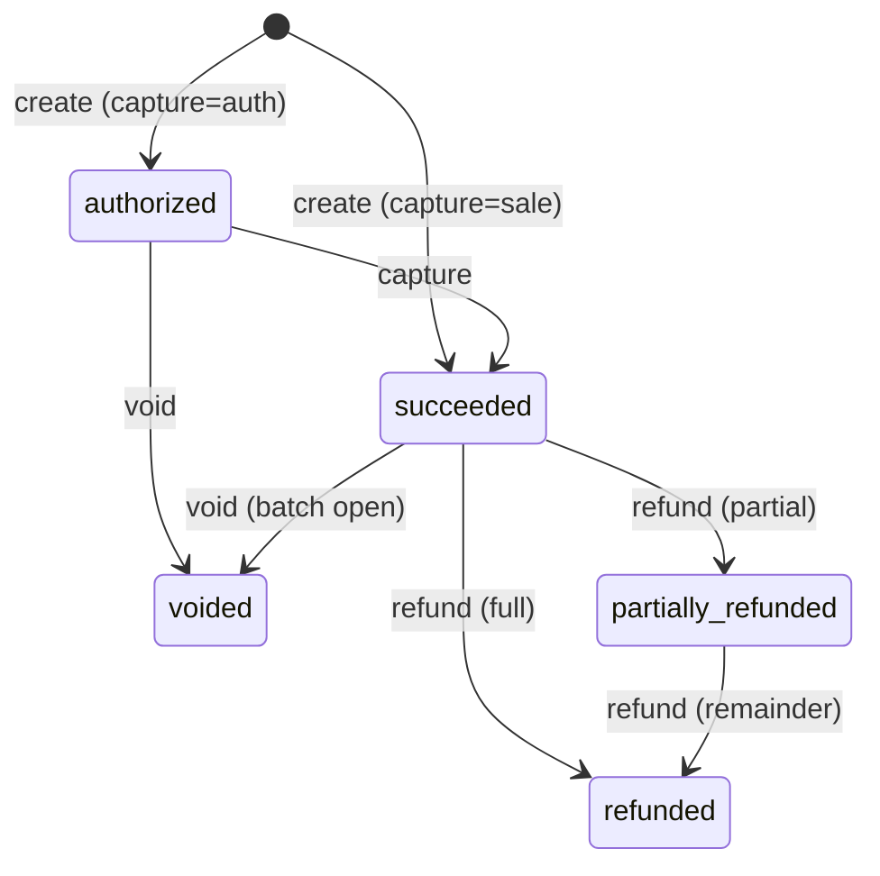

A payment moves through a defined set of states from creation to final settlement or reversal. Understanding those states — and the transitions between them — lets you design reliable integrations.

## Capture modes

`POST /payments` accepts a `capture` field that controls when funds are collected. The response echoes this back as the `captureMode` field — so the request uses `capture`, and the response reports `captureMode`.

| Mode | Behaviour | Resulting status |
|---|---|---|
| `sale` (default) | Charges the card immediately | `succeeded` |
| `auth` | Places an authorisation hold; funds are reserved but not collected | `authorized` |

For `auth` payments the response includes `authorizedAmount` (the held amount in cents) and `expiresAt` (when the hold expires). Settle the hold by calling `POST /payments/{id}/capture`.

<Warning>
A **partial** capture — passing an `amount` less than the authorised amount — settles that amount and **releases the remainder. A second capture is not possible.** Capture only succeeds when `status` is `authorized`.
</Warning>

## Status reference

| Status | Meaning |
|---|---|
| `pending` | Payment is being processed |
| `authorized` | Authorisation hold placed; awaiting capture |
| `succeeded` | Funds collected successfully |
| `failed` | Processing failed (declined or error) |
| `voided` | Cancelled before settlement |
| `refunded` | Fully reversed after settlement |
| `partially_refunded` | Partially reversed after settlement |
| `unknown` | Gateway response was ambiguous; requery before retrying |

## State diagram

## Void vs. refund

<Note>
**Void** (`POST /payments/{id}/void`) cancels a payment before its batch has settled. If the gateway rejects the void — for example because the batch already closed — you receive `422 VOID_FAILED` with `details.suggestedAction: "refund"`. The API does **not** automatically fall back to a refund.

**Refund** (`POST /payments/{id}/refund`) reverses a settled charge. Internally the API attempts a void first and falls back to a refund transaction if the batch has closed.

Rule of thumb: try void for same-day cancellations; use refund once a batch has closed.
</Note>

See [Refunds & line items](/guides/refunds-and-line-items) for full refund behaviour, partial amounts, and line-item scoping.

The exact request and response schemas for capture and void are documented in the **API Reference** tab.
